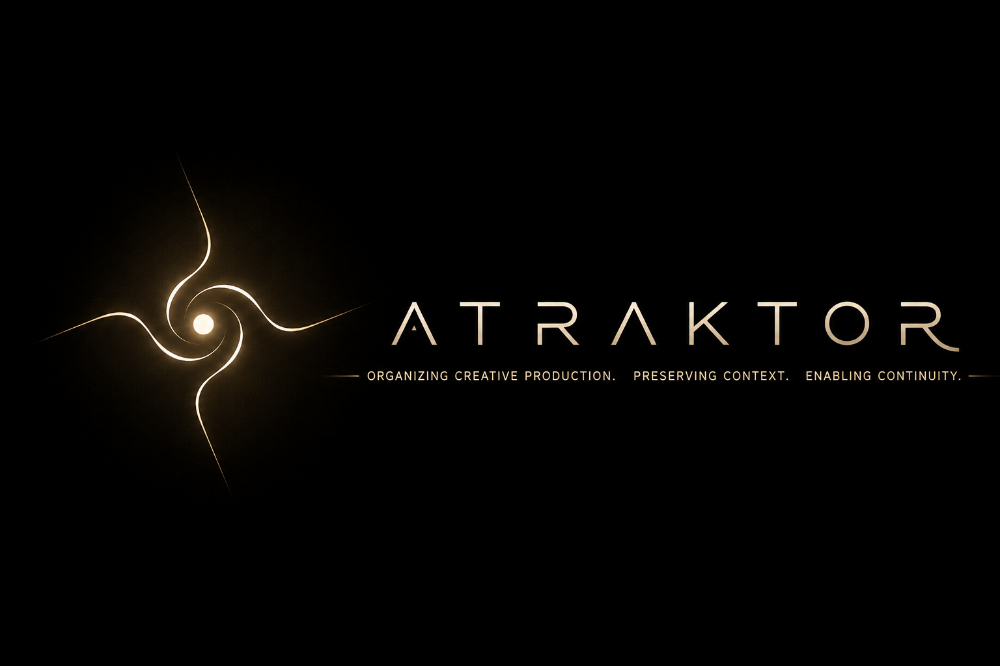
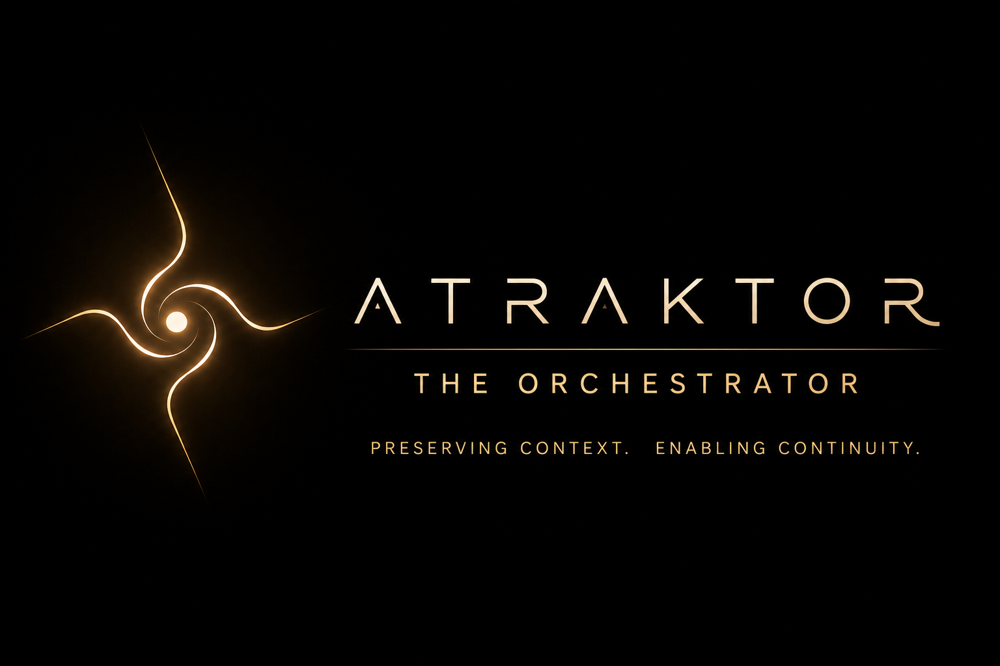
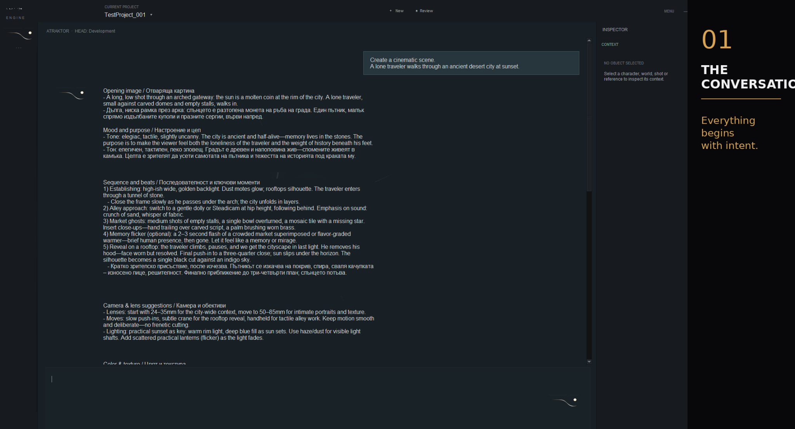
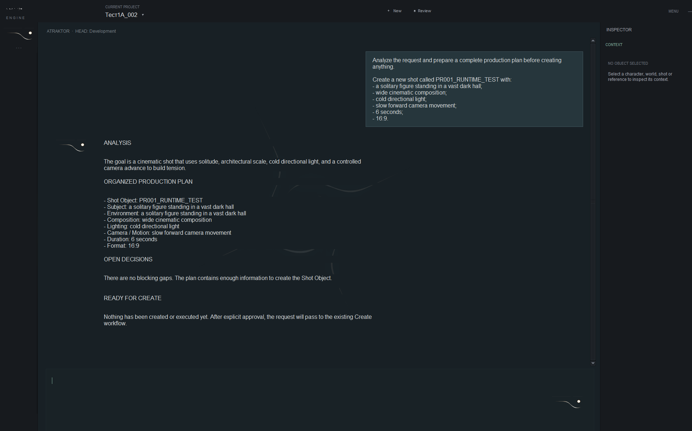
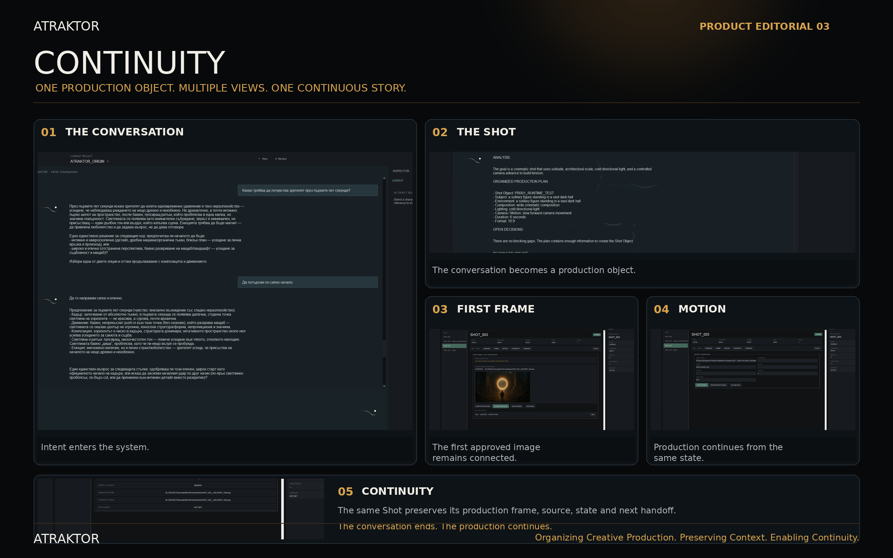

<p align="center">
  
</p>

# ATRAKTOR

## The Orchestrator

**Organizing Creative Production. Preserving Context. Enabling Continuity.**

Creative work rarely fails because we lack tools.

It fails because we lose context.

Ideas become fragmented. Versions diverge. Decisions disappear. Production loses continuity.

ATRAKTOR exists to preserve intent, organize production, and enable continuity from the first conversation to the final result.

---

<p align="center">
  
</p>

## Understand before execution

ATRAKTOR does not begin by creating.

It follows a deliberate product behavior:

```text
Intent
   ↓
Analyze
   ↓
Organize
   ↓
Approve
   ↓
Create
```

Understanding comes before execution.

---

## Product Editorial 01 — The Conversation

<p align="center">
  
</p>

**Everything begins with intent.**

The conversation is not a prompt box attached to a generator. It is the beginning of a governed creative process.

---

## Product Editorial 02 — The Orchestrator

<p align="center">
  
</p>

This is real runtime evidence of the accepted product behavior.

ATRAKTOR analyzes the request, organizes the production plan, checks whether decisions remain open, and waits for explicit approval before creation.

**Nothing is created before explicit approval.**

Canonical artifact: `ARTIFACT-PR001-RUNTIME-001`

---

## Product principles

- Preserve Context
- Enable Continuity
- Organize Production
- Govern Decisions
- Respect Creative Intent

---

## Current status

ATRAKTOR is in active development.

This public repository presents the product identity, public roadmap, Product Editorials, and canonical product evidence.

The private ENGINE repository remains the authority for implementation, architecture, tests, and runtime development.

---

## Public repository

```text
assets/       Public visual identity and editorial images
docs/         Product documentation and canonical evidence
ROADMAP.md    Public development direction
README.md     Official public landing page
```

---

**ATRAKTOR is an orchestrator, not a generator.**

---

## Product Editorial 03 — Continuity

<p align="center">
  
</p>

**One Production Object. Multiple Views. One Continuous Story.**

A conversation becomes a Shot.  
The Shot carries its First Frame, Motion, Production state and Continuity forward.

The work continues because the context survives.

[Read the editorial documentation](docs/editorials/PRODUCT_EDITORIAL_03.md)

